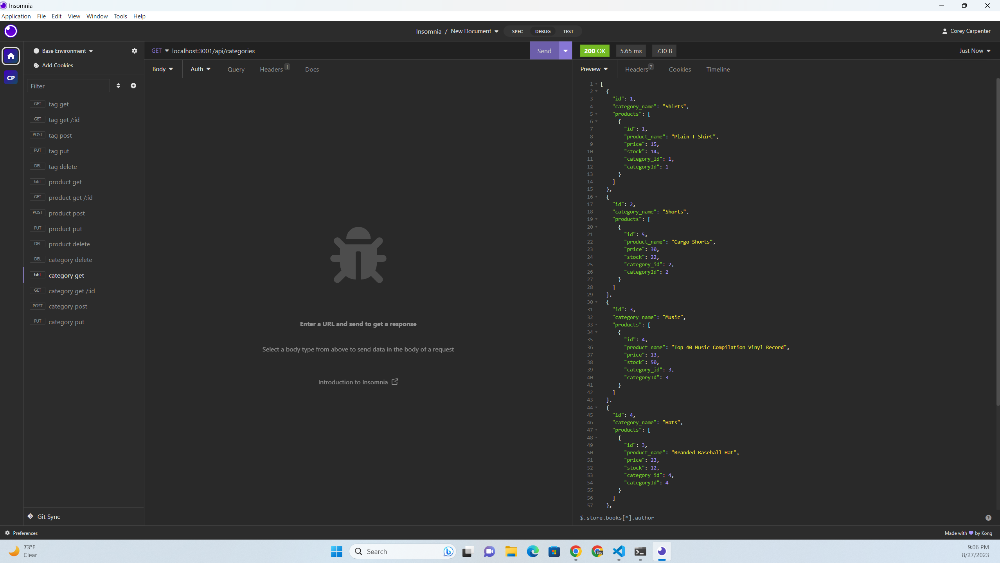

# E Commerce Back End

## A small project I Used to practice with databases and get, post, put, and delete requests. 

## Clone the github repository.

## Navigate to where you cloned the repo. Run npm i and then login into mysql wwith mysql -u root -p and run source db/schema.sql;  After that use the exit command to leave mysql. Then in the command line run npm run seed && npm run watch. After that open insomnia or a similar app and you're free to mess with the router requests.

    